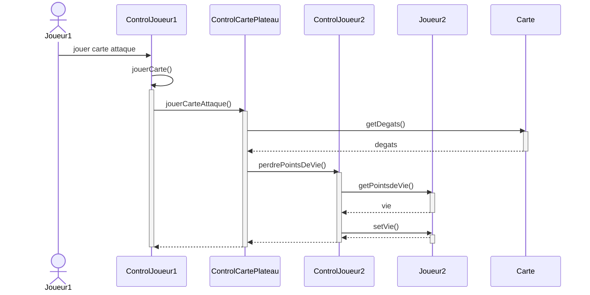

# Template Diagramme UML de séquence pour utilisation d'une carte Attaque
Rappel: deux diagrammes de séquence à faire, représentant le fonctionnement de 2 cartes différentes

Note: jouerCarte() devrait mieux utiliser l'héritage, regrouper jouerCarteAttaque(), jouerCartePop(), etc... en une seule fonction jouerCarte()

### Diagramme de séquence Mermaid:
