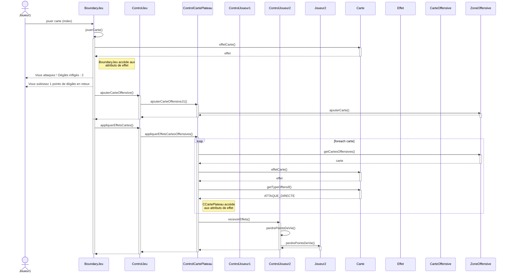

# Template Diagramme UML de séquence pour utilisation d'une carte Attaque
Rappel: deux diagrammes de séquence à faire, représentant le fonctionnement de 2 cartes différentes

Note: ControlCartePlateau::appliquerEffetsCartes() appelle des méthodes des Joueurs directement au lieu de passer par leur controleur,
 j'ai représenté ça autrement sur le diagramme (en appelant recevoirEffets des controleurs) le temps qu'on change ça

### Diagramme de séquence Mermaid:
