Acteurs :
- Jeu
- Marché
- Main
- Pioche
- Zone Attaque
- Zone Pop
- Défausse
- Zone Carte Spéciale
- Carte
- Carte Probabilité
- Carte Active
- Carte Passive
- Carte Spéciale
- Parser Carte
- txt
- Joueur

Contrôleurs :
- Control Jeu
- Control Marché
- Control Joueur
- Control Pioche
- Control Carte Plateau
- Control Carte Spéciale

Relations :
- Jeu interagit avec Control Jeu
- Marché interagit avec Control Marché
- Main interagit avec Control Joueur
- Pioche interagit avec Control Pioche
- Zone Attaque interagit avec Control Carte Plateau
- Zone Pop interagit avec Control Carte Plateau
- Défausse interagit avec Control Carte Plateau
- Zone Carte Spéciale interagit avec Control Carte Spéciale
- Carte interagit avec Control Carte Plateau
- Carte interagit avec Carte Probabilité
- Carte interagit avec Pioche
- Carte interagit avec Joueur
- Carte Probabilité interagit avec Parser Carte
- Parser Carte interagit avec txt
- Carte Active interagit avec Control Carte Plateau
- Carte Passive interagit avec Control Carte Plateau
- Carte Spéciale interagit avec Control Carte Spéciale

### Diagramme de classe (Mermaid)

```mermaid
classDiagram
    class Jeu {
        - pioche: Pioche
        - joueur1: Joueur
        - joueur2: Joueur
        + initialiserJeu(joueur1: Joueur, joueur2: Joueur): void
    }

    class Pioche {
        - pioche: List~Carte~
        + Pioche(listeCartes: List~Carte~)
        + piocher(): Carte
        + hasNext(): boolean
        + next(): Carte
    }

    class Carte {
        - type: TypeCarte
        - nomCarte: String
        - Description: String
        - valeur: int
        - id: int
        - cout: int
        - static compteurId: int
        + Carte(type: TypeCarte, nomCarte: String, description: String, valeur: int, cout: int)
        + Carte(type: TypeCarte, nomCarte: String, description: String, valeur: int)
        + Carte(type: TypeCarte, nomCarte: String, description: String)
        + getValeur(): int
        + setValeur(valeur: int): void
        + getCout(): int
        + setCout(cout: int): void
        + getId(): int
        + toString(): String
        + setDescription(description: String): void
        + getDescription(): String
        + getType(): TypeCarte
        + setNomCarte(nomCarte: String): void
        + getNomCarte(): String
        + estCarteAttaque(): boolean
        + estCartePopularite(): boolean
        + estCarteSpeciale(): boolean
        + estCartePassive(): boolean
    }

    class TypeCarte {
        <<enumeration>>
        POPULAIRE
        ATTAQUE
        SPECIALE
        PASSIVE
    }

    class CarteAttaque {
        - degats: int
        + CarteAttaque(nomCarte: String, description: String, idCarte: int, degats: int)
        + getDegats(): int
        + setDegats(degats: int): void
    }

    class CartePopularite {
        - pointsPopularite: int
        + CartePopularite(nomCarte: String, description: String, idCarte: int, pointsPopularite: int)
        + getPointsPopularite(): int
        + setPointsPopularite(pointsPopularite: int): void
    }

    class CarteSpeciale {
        - bonusSpecial: String
        + CarteSpeciale(nomCarte: String, description: String, idCarte: int)
        + CarteSpeciale(bonusSpecial: String, nomCarte: String, description: String, idCarte: int)
        + getBonusSpecial(): String
        + setBonusSpecial(bonusSpecial: String): void
    }

    class CarteCoupSpecial {
        - coutSpecial: int
        + CarteCoupSpecial(coutSpecial: int, nomCarte: String, idCarte: int, type: TypeCarte)
        + CarteCoupSpecial(coutSpecial: int, nomCarte: String, description: String, idCarte: int)
        + getCoutSpecial(): int
        + setCoutSpecial(coutSpecial: int): void
    }

    class Joueur {
        - nom: String
        - pirate: Pirate
        - vie: Integer
        - popularite: Integer
        - or: Integer
        - nbCartes: Integer
        - main: List~Carte~
        + Joueur(nom: String, pirate: Pirate)
        + getPointsDeVie(): Integer
        + setVie(vie: Integer): void
        + getPopularite(): Integer
        + setPopularite(popularite: Integer): void
        + getOr(): Integer
        + setOr(or: Integer): void
        + getNbCartes(): Integer
        + setNbCartes(nbCartes: Integer): void
        + getNom(): String
        + getPirate(): Pirate
        + ajouterCarte(carte: Carte): void
        + retirerCarte(carte: Carte): void
        + getMain(): List~Carte~
    }

    class Pirate {
        - nom: String
        - bonus: int
        + Pirate(nom: String)
        + getNom(): String
        + setNom(nom: String): void
        + getBonus(): int
        + setBonus(bonus: int): void
    }

    class ControlJeu {
        - cJ1: ControlJoueur
        - cJ2: ControlJoueur
        - cPioche: ControlPioche
        - cMarche: ControlMarche
        - cCartePlateau: ControlCartePlateau
        + ControlJeu()
        + initControllers(): void
        + initialiserMainJoueur(joueurId: int): void
        + piocherCarte(joueurId: int): Carte
        + defausserCarte(joueurId: int, indexCarte: int): void
        + getControlMarche(): ControlMarche
        + setJoueur1(nom: String, pirate: Pirate): void
        + setJoueur2(nom: String, pirate: Pirate): void
        + jouerTour(joueurId: int): void
        + verifierVictoire(): boolean
        + afficherMain(joueurId: int): List~Carte~
        + jouerCarte(joueurId: int, indexCarte: int): void
        + getJoueur(joueurId: int): Joueur
    }

    class ControlJoueur {
        - joueur: Joueur
        - cCartePlateau: ControlCartePlateau
        - cPioche: ControlPioche
        + ControlJoueur(joueur: Joueur, cCartePlateau: ControlCartePlateau, cPioche: ControlPioche)
        + setJoueur(joueur: Joueur): void
        + piocher(): Carte
        + initialiserMain(): void
        + afficherMain(): List~Carte~
        + retirerCarte(carte: Carte): void
        + perdrePointsDeVie(points: int): void
        + gagnerPopularite(points: int): void
        + recevoirEffets(vie: int, pop: int): void
        + jouerCarte(carte: Carte): void
        + getJoueur(): Joueur
        + jouerTour(): void
        + setControlCartePlateau(controlCartePlateau: ControlCartePlateau): void
    }

    class ControlPioche {
        - pioche: Pioche
        + ControlPioche()
        + piocher(): Carte
    }

    class ControlCartePlateau {
        - controlJoueur1: ControlJoueur
        - controlJoueur2: ControlJoueur
        + ControlCartePlateau(controlJoueur1: ControlJoueur, controlJoueur2: ControlJoueur)
        + jouerCarteAttaque(carte: Carte, joueur: Joueur): void
        + jouerCartePopularite(carte: Carte, joueur: Joueur): void
        + jouerCarteSpeciale(carte: Carte, joueur: Joueur): void
        + jouerCartePassive(carte: Carte, joueur: Joueur): void
    }

    class ControlCarteSpeciale {
        + activerCarteSpeciale(carte: CarteCoupSpecial): void
    }

    class ControlMarche {
        - cartesDisponibles: List~Carte~
        - controlJoueur1: ControlJoueur
        - controlJoueur2: ControlJoueur
        - controlPioche: ControlPioche
        - random: Random
        + ControlMarche(controlJoueur1: ControlJoueur, controlJoueur2: ControlJoueur, controlPioche: ControlPioche)
        + rafraichirMarche(): void
        + getCartesDisponibles(): List~Carte~
        + acheterCarte(joueurId: int, indexCarte: int): boolean
        + vendreCarte(joueurId: int, indexCarte: int): boolean
    }

    class BoundaryJeu {
        - controlJeu: ControlJeu
        - controlMarche: ControlMarche
        - scanner: Scanner
        + BoundaryJeu(controlJeu: ControlJeu, controlMarche: ControlMarche)
        + afficherRegles(): void
        + configurerJoueurs(): void
        + initialiserMains(): void
        + afficherEtatJoueur(joueurId: int): void
        + afficherMain(joueurId: int): void
        + gererMarche(joueurId: int): void
        + jouerTour(joueurId: int): void
        + afficherResultats(): void
        + lancerJeu(): void
    }

    class ZoneAttaque {
        - cartesAttaque: List~CarteAttaque~
        + ajouterCarte(carte: CarteAttaque): void
        + getCartesAttaque(): List~CarteAttaque~
    }

    class ZonePop {
        - cartesPopularite: List~CartePopularite~
        + ajouterCarte(carte: CartePopularite): void
        + getCartesPopularite(): List~CartePopularite~
    }

    class ZoneCarteSpeciale {
        - cartesSpeciales: List~CarteSpeciale~
        + ajouterCarte(carte: CarteSpeciale): void
        + getCartesSpeciales(): List~CarteSpeciale~
    }

    class Defausse {
        - cartesDefaussees: List~Carte~
        + ajouterCarte(carte: Carte): void
        + viderDefausse(): void
        + getCartesDefaussees(): List~Carte~
    }

    class ParserCarte {
        + lireCarte(cheminFichier: String): Carte
    }

    class Ressource {
        - or: int
        - bois: int
        + getOr(): int
        + getBois(): int
        + setOr(or: int): void
        + setBois(bois: int): void
    }

    class Marche {
        - ressources: List~Ressource~
        + acheterRessource(ressource: Ressource): void
        + vendreRessource(ressource: Ressource): void
    }

    Carte --> TypeCarte
    CarteAttaque --|> Carte
    CartePopularite --|> Carte
    CarteSpeciale --|> Carte
    CarteCoupSpecial --|> CarteSpeciale
    
    Jeu --> Pioche
    Jeu --> Joueur
    
    Joueur --> Pirate
    Joueur --> Carte
    
    Pioche --> Carte
    
    ControlJeu --> ControlJoueur
    ControlJeu --> ControlPioche
    ControlJeu --> ControlMarche
    ControlJeu --> ControlCartePlateau
    
    ControlJoueur --> Joueur
    ControlJoueur --> ControlCartePlateau
    ControlJoueur --> ControlPioche
    
    ControlCartePlateau --> ControlJoueur
    
    ControlPioche --> Pioche
    
    ControlMarche --> ControlJoueur
    ControlMarche --> ControlPioche
    ControlMarche --> Carte
    
    ControlCarteSpeciale --> CarteCoupSpecial
    
    BoundaryJeu --> ControlJeu
    BoundaryJeu --> ControlMarche
    
    ZoneAttaque --> CarteAttaque
    ZonePop --> CartePopularite
    ZoneCarteSpeciale --> CarteSpeciale
    
    Defausse --> Carte
    
    Marche --> Ressource
```
